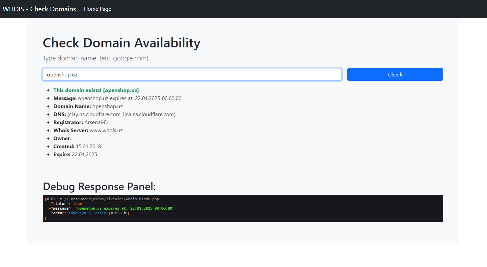
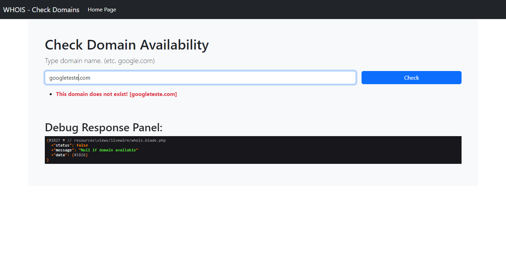

## Task: WhoIs Checker Livewire (For job review)

Realtime check domain whois in live mode (Livewire)

Requirements: Laravel v9, PHP v8, Composer v2, npm

<p align="center">
    
    
</p>

### Step Installation

```shell
composer install
```

```shell
npm i
```

```shell
cp .env.example .env
```

> Edit .env file to configure your web app

```shell
php artisan key:generate
```

```shell
php artisan storage:link
```

Run 2 shell, first artisan, second npm

```shell
php artisan serve
```

```shell
npm run dev
```

Author: @UzSoftic
